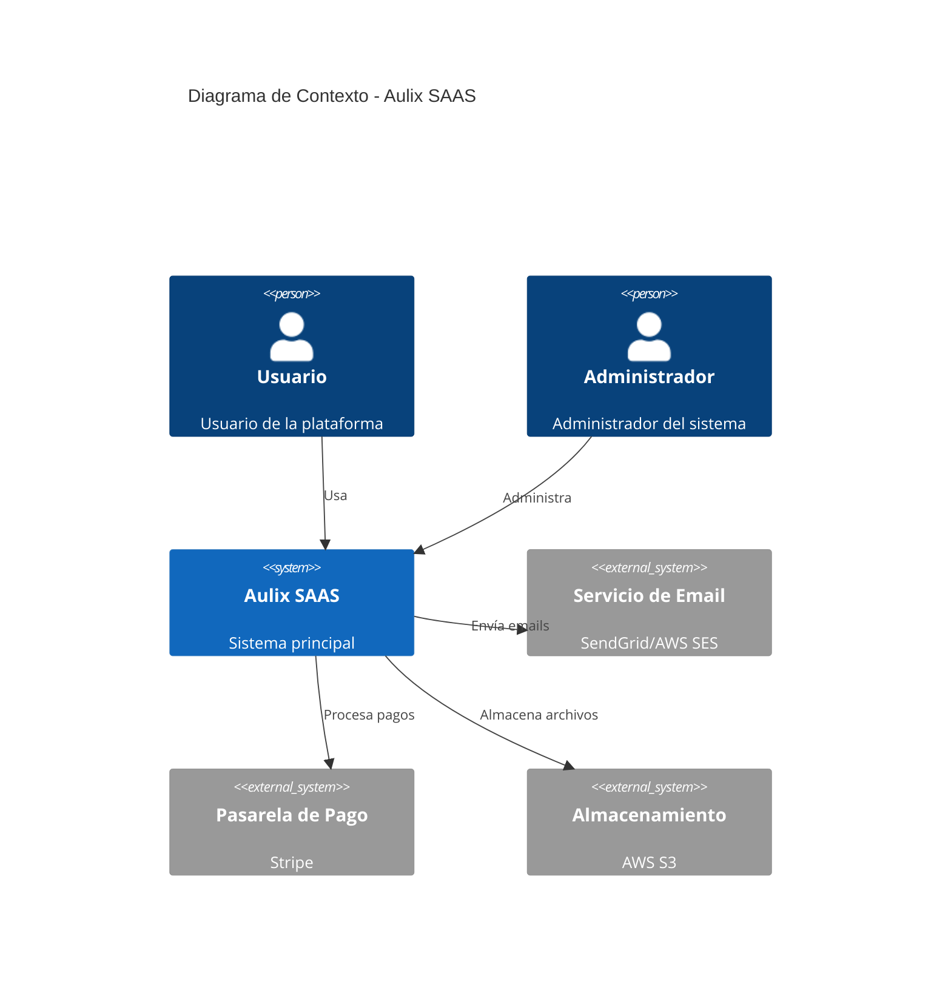
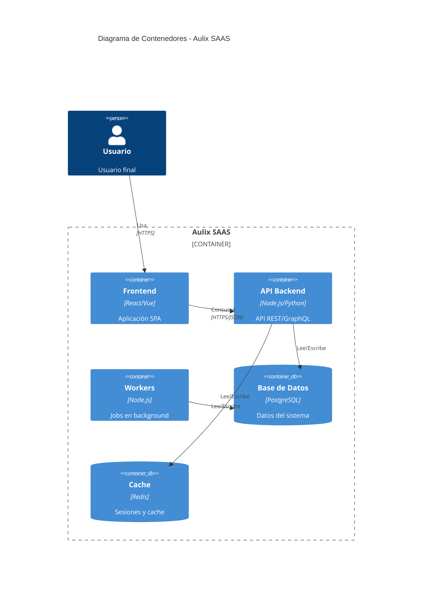

# Arquitectura del Sistema

## Diagrama de Contexto (C4 - Nivel 1)



## Diagrama de Contenedores (C4 - Nivel 2)



## Arquitectura de Alto Nivel

```
┌─────────────────────────────────────────────────────────────────┐
│                         CLIENTE                                  │
│  ┌─────────────┐  ┌─────────────┐  ┌─────────────┐              │
│  │   Web App   │  │  Mobile App │  │   CLI/API   │              │
│  └──────┬──────┘  └──────┬──────┘  └──────┬──────┘              │
└─────────┼────────────────┼────────────────┼─────────────────────┘
          │                │                │
          ▼                ▼                ▼
┌─────────────────────────────────────────────────────────────────┐
│                      LOAD BALANCER                               │
│                    (Nginx / AWS ALB)                             │
└─────────────────────────────┬───────────────────────────────────┘
                              │
┌─────────────────────────────┼───────────────────────────────────┐
│                      API GATEWAY                                 │
│  ┌────────────┐  ┌─────────────────┐  ┌────────────────┐        │
│  │    Auth    │  │   Rate Limit    │  │    Logging     │        │
│  └────────────┘  └─────────────────┘  └────────────────┘        │
└─────────────────────────────┬───────────────────────────────────┘
                              │
┌─────────────────────────────┼───────────────────────────────────┐
│                       SERVICIOS                                  │
│  ┌──────────┐  ┌──────────┐  ┌──────────┐  ┌──────────┐         │
│  │   Auth   │  │  Users   │  │  [Core]  │  │ Payments │         │
│  │ Service  │  │ Service  │  │ Service  │  │ Service  │         │
│  └────┬─────┘  └────┬─────┘  └────┬─────┘  └────┬─────┘         │
└───────┼─────────────┼─────────────┼─────────────┼───────────────┘
        │             │             │             │
┌───────┼─────────────┼─────────────┼─────────────┼───────────────┐
│       ▼             ▼             ▼             ▼               │
│  ┌─────────────────────────────────────────────────────────┐    │
│  │                    BASE DE DATOS                        │    │
│  │                     (PostgreSQL)                        │    │
│  └─────────────────────────────────────────────────────────┘    │
│  ┌──────────────────┐  ┌──────────────────┐                     │
│  │      Redis       │  │   File Storage   │                     │
│  │   (Cache/Queue)  │  │    (AWS S3)      │                     │
│  └──────────────────┘  └──────────────────┘                     │
└─────────────────────────────────────────────────────────────────┘
```

## Stack Tecnológico

### Frontend

| Tecnología | Uso |
|------------|-----|
| React/Vue/Angular | Framework principal |
| TypeScript | Tipado estático |
| TailwindCSS | Estilos |
| Vite | Build tool |

### Backend

| Tecnología | Uso |
|------------|-----|
| Node.js / Python | Runtime |
| Express / FastAPI | Framework |
| PostgreSQL | Base de datos |
| Redis | Cache y colas |

### Infraestructura

| Tecnología | Uso |
|------------|-----|
| Docker | Containerización |
| Kubernetes / ECS | Orquestación |
| AWS / GCP | Cloud provider |
| GitHub Actions | CI/CD |

## Decisiones de Arquitectura (ADRs)

### ADR-001: Arquitectura de Microservicios vs Monolito

**Contexto**: Necesitamos decidir la arquitectura inicial.

**Decisión**: Comenzar con un **monolito modular** para el MVP.

**Razones**:
- Menor complejidad inicial
- Más rápido de desarrollar
- Fácil de refactorizar a microservicios después

**Consecuencias**:
- Código bien organizado en módulos
- Preparar interfaces para futura separación
