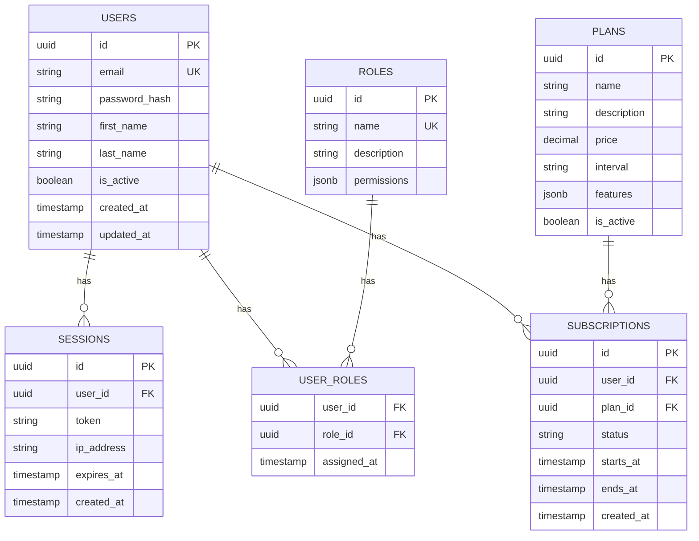

# Diseño de Base de Datos

## Diagrama Entidad-Relación (ERD)



## Esquema de Tablas

### Tabla: `users`

```sql
CREATE TABLE users (
    id UUID PRIMARY KEY DEFAULT gen_random_uuid(),
    email VARCHAR(255) NOT NULL UNIQUE,
    password_hash VARCHAR(255) NOT NULL,
    first_name VARCHAR(100),
    last_name VARCHAR(100),
    avatar_url VARCHAR(500),
    is_active BOOLEAN DEFAULT true,
    email_verified_at TIMESTAMP,
    created_at TIMESTAMP DEFAULT CURRENT_TIMESTAMP,
    updated_at TIMESTAMP DEFAULT CURRENT_TIMESTAMP
);

CREATE INDEX idx_users_email ON users(email);
CREATE INDEX idx_users_created_at ON users(created_at);
```

### Tabla: `roles`

```sql
CREATE TABLE roles (
    id UUID PRIMARY KEY DEFAULT gen_random_uuid(),
    name VARCHAR(50) NOT NULL UNIQUE,
    description TEXT,
    permissions JSONB DEFAULT '[]',
    created_at TIMESTAMP DEFAULT CURRENT_TIMESTAMP
);

-- Roles por defecto
INSERT INTO roles (name, description, permissions) VALUES
    ('admin', 'Administrador del sistema', '["*"]'),
    ('user', 'Usuario estándar', '["read", "write"]'),
    ('viewer', 'Solo lectura', '["read"]');
```

### Tabla: `sessions`

```sql
CREATE TABLE sessions (
    id UUID PRIMARY KEY DEFAULT gen_random_uuid(),
    user_id UUID NOT NULL REFERENCES users(id) ON DELETE CASCADE,
    token VARCHAR(500) NOT NULL,
    ip_address INET,
    user_agent TEXT,
    expires_at TIMESTAMP NOT NULL,
    created_at TIMESTAMP DEFAULT CURRENT_TIMESTAMP
);

CREATE INDEX idx_sessions_user_id ON sessions(user_id);
CREATE INDEX idx_sessions_token ON sessions(token);
CREATE INDEX idx_sessions_expires_at ON sessions(expires_at);
```

## Migraciones

### Convención de Nombres

```
YYYYMMDDHHMMSS_descripcion_del_cambio.sql
```

Ejemplo:
```
20250101120000_create_users_table.sql
20250101120100_create_roles_table.sql
20250101120200_add_avatar_to_users.sql
```

### Ejemplo de Migración

```sql
-- Migration: 20250101120000_create_users_table.sql
-- Up
CREATE TABLE users (
    id UUID PRIMARY KEY DEFAULT gen_random_uuid(),
    email VARCHAR(255) NOT NULL UNIQUE,
    password_hash VARCHAR(255) NOT NULL,
    created_at TIMESTAMP DEFAULT CURRENT_TIMESTAMP
);

-- Down
DROP TABLE IF EXISTS users;
```

## Índices Recomendados

| Tabla | Columna(s) | Tipo | Razón |
|-------|------------|------|-------|
| users | email | UNIQUE | Búsqueda por email |
| users | created_at | BTREE | Ordenamiento |
| sessions | token | HASH | Validación de sesión |
| sessions | expires_at | BTREE | Limpieza de sesiones |

## Consideraciones de Rendimiento

::: tip Optimizaciones
1. **Usar UUIDs** como PKs para evitar colisiones en sistemas distribuidos
2. **Índices parciales** para queries frecuentes con condiciones
3. **JSONB** para datos flexibles con indexación GIN
4. **Particionamiento** de tablas grandes por fecha
:::

::: warning Evitar
- Índices en columnas con alta cardinalidad de escritura
- Queries sin índices en tablas grandes
- JOINs excesivos (considerar desnormalización)
:::
